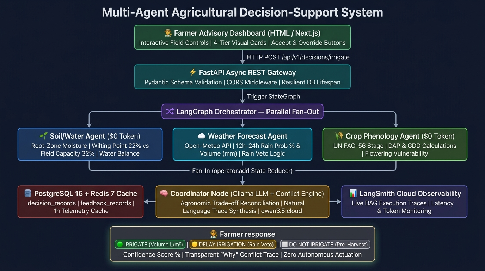
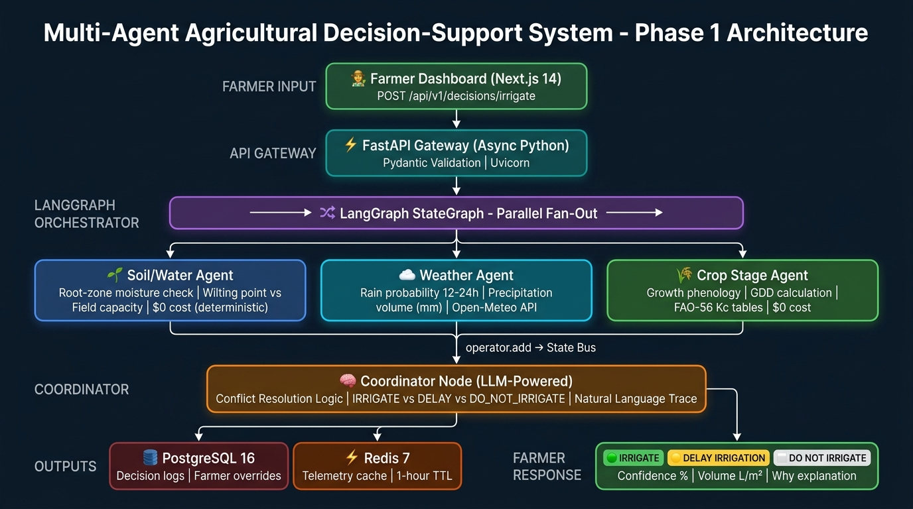

# System Architecture Diagrams

This directory contains the visual architecture diagrams for the **Multi-Agent Agricultural Decision-Support System**.

---

## 🏛️ End-to-End System Architecture

---

## 🔍 Architecture Layer Breakdown

1. **Client Tier (Farmer Dashboard)**:
   - Built with high-contrast, glanceable 4-tier visual cards.
   - Interactive farm preset selector and real-time advisory controls.
   - Human-in-the-Loop **Accept** and **Manual Override** buttons.

2. **API Gateway (FastAPI Async REST)**:
   - High-throughput asynchronous endpoints with strict Pydantic model validation.
   - Endpoints: `POST /api/v1/decisions/irrigate`, `POST /api/v1/decisions/feedback`, `GET /api/v1/telemetry/live`, `GET /api/v1/decisions/history`.

3. **Multi-Agent Orchestrator (LangGraph Parallel Fan-Out → Fan-In)**:
   - Parallel concurrent execution across specialized domain agents:
     - **🌱 Soil/Water Agent ($0 Token)**: Root-zone volumetric water balance against Wilting Point ($22\%$) and Field Capacity ($32\%$).
     - **☁️ Weather Forecast Agent**: 12–24h precipitation probabilities and rain volume from live Open-Meteo feeds.
     - **🌾 Crop Phenology Agent ($0 Token)**: FAO-56 growth stages, DAP, and GDD vulnerability metrics.
   - Converges via typed state reducers (`operator.add`) into the **Coordinator Node**.

4. **Coordinator Node & Synthesis**:
   - Reconciles agronomic conflicts (e.g. soil deficit vs. incoming rain, pre-harvest drying overrides).
   - Uses **Ollama (`qwen3.5:cloud` / `llama3.2`)** to synthesize transparent natural language explanations.

5. **Persistence & Observability**:
   - **PostgreSQL 16**: Relational storage for decision audit trails (`decision_records`) and human-in-the-loop feedback (`feedback_records`).
   - **Redis 7**: High-speed telemetry caching with 1-hour TTL.
   - **LangSmith Tracing v2**: Real-time cloud monitoring of execution graphs, token costs, and step latency.

---

## 🔄 Phase 1 LangGraph Execution Flow

